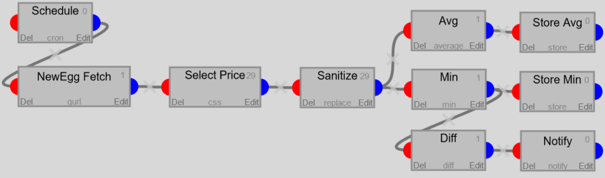

# Go Watch

A change detection server that can notify through various services written in Go

# Intro

GoWatch works through filters, a filter performs certain operations on the input it recieves.  
Here is an example of a 'Watch' that calculates the lowest and average price of 4090s on NewEgg and notifies the user if the lowest price changed:  

## type script compilation

`tsc static/*.ts --lib es2020,dom --watch --downlevelIteration`

# Dependencies

The following libaries are used in Go-Watch:  
- [Gin](https://github.com/gin-gonic/gin) for HTTP server
    - [multitemplate](https://github.com/gin-contrib/multitemplate) for template inheritance
- [Cascadia](https://pkg.go.dev/github.com/andybalholm/cascadia) for CSS selectors
- [htmlquery](https://pkg.go.dev/github.com/antchfx/htmlquery) for XPath selectors
- [validator](https://pkg.go.dev/github.com/go-playground/validator/v10@v10.11.0) for user user input validation
- [tgbotapi](https://pkg.go.dev/github.com/go-telegram-bot-api/telegram-bot-api/v5@v5.5.1) for Telegram
- [cron](https://pkg.go.dev/github.com/robfig/cron/v3@v3.0.0) for job scheduling
- [viper](https://pkg.go.dev/github.com/spf13/viper@v1.12.0) for config management
- [gjson](https://pkg.go.dev/github.com/tidwall/gjson@v1.14.2) for JSON selectors
- [gopher-lua](https://github.com/yuin/gopher-lua) for Lua scripting
    - [gopher-lua-libs](https://pkg.go.dev/github.com/vadv/gopher-lua-libs@v0.4.0) for expanding the Lua scripting functionality
- [net](https://pkg.go.dev/golang.org/x/net) for http fetching
- [gorm](https://pkg.go.dev/gorm.io/gorm@v1.23.8) for database abstraction
    - [sqlite](https://pkg.go.dev/gorm.io/driver/sqlite@v1.3.6)
    - [postgres](https://github.com/go-gorm/postgres)
    - [mysql](https://github.com/go-gorm/mysql)
    - [sqlserver](https://github.com/go-gorm/sqlserver)
- [bootstrap](https://getbootstrap.com/)